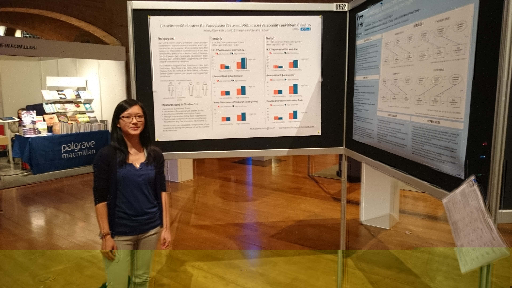

title: About Me
date: 2015-06-03 17:24:27
---

Mandy Tjew A Sin obtained her Bachelor’s degree in Psychology and Research Master’s degree in Social and Organisational Psychology and Cognitive Neuroscience at Leiden University, The Netherlands. She is currently working towards a PhD at the VU University in Amsterdam under the supervision of Dr Sander Koole. Specifically, she examines the effects of (simulated) touch on social cognition and the effects of belonging on the academic performance of minority students.

You may contact her at [m.m.tjew-a-sin@vu.nl](mailto:m.m.tjew-a-sin@vu.nl)
